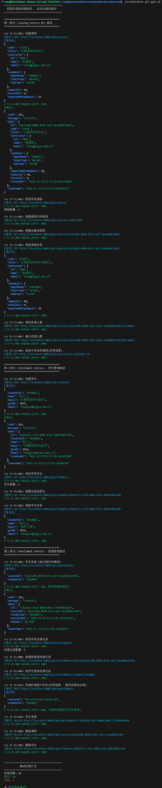
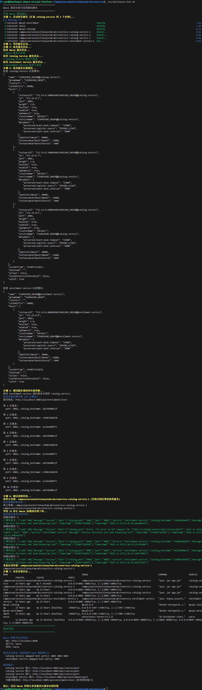

# 服务发现实验 - 架构演进思考

---

## Nacos 服务注册与发现集成总结

### 项目概述

本项目成功集成了 Nacos 作为服务注册与发现中心，实现了微服务架构中的动态服务发现和负载均衡功能。

### 完成的功能

#### 1. Nacos 服务器部署

- 使用 Docker 部署 Nacos 服务器（单机模式）
- 控制台访问地址：`http://localhost:8848/nacos`
- 默认账号密码：`nacos/nacos`

#### 2. 服务注册配置

| 服务               | 服务名               | 端口 | 分组              | 命名空间 |
| ------------------ | -------------------- | ---- | ----------------- | -------- |
| Catalog Service    | `catalog-service`    | 8081 | `COURSEHUB_GROUP` | `dev`    |
| Enrollment Service | `enrollment-service` | 8082 | `COURSEHUB_GROUP` | `dev`    |

#### 3. 服务发现与负载均衡

- 使用 Spring Cloud LoadBalancer 实现客户端负载均衡
- RestTemplate 配置了 `@LoadBalanced` 注解
- 支持轮询（Round Robin）负载均衡策略

#### 4. 健康检查

- 所有服务配置了 Actuator 健康检查端点
- Nacos 能够监控服务健康状态
- 心跳间隔：5 秒，心跳超时：15 秒

### 配置文件示例

**application.yml (Catalog Service)**

```yaml
spring:
  application:
    name: catalog-service
  cloud:
    nacos:
      discovery:
        server-addr: nacos:8848
        namespace: dev
        group: COURSEHUB_GROUP
        ephemeral: true
        heart-beat-interval: 5000
        heart-beat-timeout: 15000
```

**docker-compose.yml (核心部分)**

```yaml
services:
  nacos:
    image: nacos/nacos-server:v3.1.0
    container_name: nacos
    environment:
      MODE: standalone
    ports:
      - "8848:8848"
      - "9848:9848"
    networks:
      - course-cloud-network

  catalog-service:
    depends_on:
      - nacos
      - mysql
    ports:
      - "8081:8081"
    networks:
      - course-cloud-network

  enrollment-service:
    depends_on:
      - nacos
      - mysql
    ports:
      - "8082:8082"
    networks:
      - course-cloud-network
```

### 测试端点

| 功能                | 端点                                             |
| ------------------- | ------------------------------------------------ |
| Catalog 健康检查    | `GET http://localhost:8081/actuator/health`      |
| Enrollment 健康检查 | `GET http://localhost:8082/actuator/health`      |
| Catalog 端口信息    | `GET http://localhost:8081/api/courses/port`     |
| Enrollment 端口信息 | `GET http://localhost:8082/api/enrollments/port` |
| 负载均衡测试        | `GET http://localhost:8085/api/enrollments/test` |

### 运维监控

**Nacos 控制台功能：**

1. **服务管理**：查看已注册的服务列表
2. **实例管理**：查看每个服务的实例详情
3. **健康检查**：监控实例健康状态
4. **配置管理**：统一管理配置（未启用）

### 最佳实践

1. **服务命名规范**：使用小写字母和连字符 `service-name`，避免使用下划线和大写字母
2. **分组和命名空间**：使用分组进行环境隔离，使用命名空间进行多租户隔离
3. **健康检查配置**：心跳间隔 5-10 秒，心跳超时应是心跳间隔的 3 倍
4. **负载均衡策略**：默认使用轮询策略，可根据需要配置权重

### 故障排查命令

```bash
# 查看服务注册情况
curl "http://localhost:8848/nacos/v1/ns/instance/list?serviceName=catalog-service"

# 查看容器状态
docker compose ps

# 查看服务日志
docker logs [container-name]
```

### 集成成果

✅ **服务自动注册**：服务启动时自动注册到 Nacos  
✅ **服务动态发现**：通过服务名而不是硬编码地址调用服务  
✅ **负载均衡**：请求均匀分配到多个服务实例  
✅ **故障转移**：实例下线时自动切换到健康实例

---

## 1. 对比使用 Nacos 前后，服务间调用方式有什么变化？带来了哪些好处？

### 使用 Nacos 前的调用方式

**硬编码 IP 地址：**

```java
// 硬编码服务地址，缺乏灵活性
String catalogServiceUrl = "http://localhost:8081";
Course course = restTemplate.getForObject(catalogServiceUrl + "/api/courses/" + courseId, Course.class);
```

**存在的问题：**

- 服务地址硬编码，无法动态调整
- 服务实例变更需要修改代码并重新部署
- 无法实现负载均衡和故障转移
- 生产环境中服务发现困难
- 容器化部署时 IP 地址不固定

### 使用 Nacos 后的调用方式

**服务名调用：**

```java
// 使用服务名进行调用，支持动态发现
String catalogServiceUrl = "http://catalog-service";
Course course = restTemplate.getForObject(catalogServiceUrl + "/api/courses/" + courseId, Course.class);
```

**带来的好处：**

1. **动态服务发现**

   - 服务自动注册到 Nacos，客户端无需关心具体 IP 地址
   - 服务实例变更时，客户端自动感知，无需重启

2. **负载均衡**

   - Spring Cloud LoadBalancer 自动在多个实例间分配请求
   - 支持轮询、随机等多种负载均衡策略
   - 提高系统吞吐量和可用性

3. **故障转移**

   - 实例下线时，请求自动转移到健康实例
   - 提高系统的容错能力和可用性
   - 支持优雅降级

4. **运维便利性**

   - 统一的服务管理界面（Nacos 控制台）
   - 实时监控服务健康状态
   - 便于服务治理和运维管理

5. **容器化友好**
   - 完美适配 Docker 容器的动态 IP 环境
   - 支持服务的弹性伸缩
   - 简化微服务部署和管理

## 2. Nacos 的临时实例和持久实例有什么区别？当前项目适合使用哪种？

### 临时实例（Ephemeral Instance）

**特点：**

- 实例注册后，需要定期发送心跳保持活跃状态
- 心跳超时后，Nacos 自动将实例标记为不健康并移除
- 适用于无状态服务、可快速重启的服务
- 默认心跳间隔：5 秒，心跳超时：15 秒

**优势：**

- 自动故障检测和移除
- 资源清理及时，不会留下僵尸实例
- 适合微服务架构中的无状态服务

### 持久实例（Persistent Instance）

**特点：**

- 实例注册后不需要发送心跳
- 只有主动调用 API 才能移除实例
- 适用于有状态服务、不能轻易重启的服务
- 需要手动管理实例生命周期

**优势：**

- 实例稳定，不会因为网络抖动被误删
- 适合需要持久化状态的服务
- 便于人工干预和管理

### 当前项目的选择

**当前项目适合使用临时实例**，原因如下：

1. **服务特性**

   - catalog-service 和 enrollment-service 都是无状态服务
   - 服务可以快速重启，不依赖本地状态

2. **部署环境**

   - 使用 Docker 容器部署，实例可以快速创建和销毁
   - 需要支持弹性伸缩

3. **运维需求**

   - 需要自动故障检测和恢复
   - 希望减少人工干预

4. **当前配置**
   ```yaml
   spring:
     cloud:
       nacos:
         discovery:
           ephemeral: true # 使用临时实例
           heart-beat-interval: 5000
           heart-beat-timeout: 15000
   ```

这种配置完全符合当前项目的需求。

## 3. 如果 Nacos 服务器宕机，已经启动的服务还能正常通信吗？为什么？

### 答案：有限度的正常通信

**通信情况分析：**

1. **服务发现功能失效**

   - 无法发现新注册的服务实例
   - 无法获取服务实例的最新状态变化
   - 负载均衡器无法更新实例列表

2. **已建立的通信可能继续**

   - 如果客户端已经缓存了服务实例列表
   - 如果使用的是直接的 HTTP 调用（非每次都查询 Nacos）
   - 如果目标服务实例仍然正常运行

3. **Spring Cloud LoadBalancer 的行为**
   - LoadBalancer 会缓存服务实例列表
   - 在缓存有效期内，可以继续进行负载均衡
   - 但无法感知实例的健康状态变化

### 具体场景分析

**场景 1：Nacos 宕机后服务重启**

- 新启动的服务无法注册到 Nacos
- 其他服务无法发现这个新实例
- 服务间通信会失败

**场景 2：Nacos 宕机前已启动的服务**

- 服务间通信可能在一段时间内正常
- 依赖本地缓存和连接池
- 但无法处理实例故障和负载变化

### 高可用方案

为了解决这个问题，生产环境应该：

1. **部署 Nacos 集群**

   - 多个 Nacos 节点组成集群
   - 通过 Raft 协议保证数据一致性
   - 避免单点故障

2. **服务降级策略**
   - 配置静态服务列表作为备选
   - 实现服务发现的本地缓存机制

## 4. 命名空间 (Namespace) 和分组 (Group) 的作用是什么？如何利用它们实现环境隔离？

### 命名空间 (Namespace)

**作用：**

- 用于隔离不同环境或不同租户的服务
- 提供最高级别的隔离级别
- 不同命名空间的服务完全隔离，互不可见

**典型用途：**

- 环境隔离：dev, test, staging, prod
- 多租户隔离：不同客户或业务线
- 版本隔离：不同版本的服务并存

### 分组 (Group)

**作用：**

- 用于组织相关的服务
- 提供中等级别的隔离
- 同一命名空间内，不同组的服务相互隔离

**典型用途：**

- 业务模块分组：user-group, order-group, payment-group
- 服务层级分组：frontend-services, backend-services, middleware-services
- 团队分组：team-a-services, team-b-services

### 环境隔离实现方案

**方案 1：基于命名空间的环境隔离**

```yaml
# 开发环境配置
spring:
  cloud:
    nacos:
      discovery:
        server-addr: nacos:8848
        namespace: dev  # 开发环境命名空间
        group: COURSEHUB_GROUP

# 测试环境配置
spring:
  cloud:
    nacos:
      discovery:
        server-addr: nacos:8848
        namespace: test  # 测试环境命名空间
        group: COURSEHUB_GROUP

# 生产环境配置
spring:
  cloud:
    nacos:
      discovery:
        server-addr: nacos:8848
        namespace: prod  # 生产环境命名空间
        group: COURSEHUB_GROUP
```

**方案 2：基于分组的环境隔离**

```yaml
# 开发环境
spring:
  cloud:
    nacos:
      discovery:
        group: DEV_GROUP

# 测试环境
spring:
  cloud:
    nacos:
      discovery:
        group: TEST_GROUP

# 生产环境
spring:
  cloud:
    nacos:
      discovery:
        group: PROD_GROUP
```

### 推荐的环境隔离策略

**最佳实践：命名空间 + 分组组合使用**

```
命名空间: dev
├── 分组: COURSEHUB_GROUP (核心服务)
├── 分组: INFRA_GROUP (基础设施服务)
└── 分组: MONITOR_GROUP (监控服务)

命名空间: test
├── 分组: COURSEHUB_GROUP (核心服务)
├── 分组: INFRA_GROUP (基础设施服务)
└── 分组: MONITOR_GROUP (监控服务)

命名空间: prod
├── 分组: COURSEHUB_GROUP (核心服务)
├── 分组: INFRA_GROUP (基础设施服务)
└── 分组: MONITOR_GROUP (监控服务)
```

### 当前项目的配置

当前项目使用了分组进行环境标识：

```yaml
spring:
  cloud:
    nacos:
      discovery:
        group: COURSEHUB_GROUP # 业务分组
        # 没有指定命名空间，使用默认命名空间 (public)
```

**改进建议：**
可以为不同环境创建不同的命名空间，实现更彻底的环境隔离。

## 总结

通过引入 Nacos，我们的微服务架构在服务发现、负载均衡、故障转移等方面得到了显著提升。临时实例的选择适合无状态服务的特性，而命名空间和分组为多环境部署提供了灵活的隔离机制。在生产环境中，建议部署 Nacos 集群以确保高可用性。

---

## 测试验证

### 功能测试概要

- **测试环境**：Docker Compose，Catalog `8081`、Enrollment `8082`，MySQL 分别映射 `3307/3308`
- **覆盖范围**：Catalog API 8 个端点（CRUD、人数增减）；Enrollment API 12 个端点（学生管理、选课全流程）；服务间通信与异常场景
- **关键用例**：重复代码校验、容量限制、服务不可用/网络超时容错、重复选课、防止选课时课程或学生不存在
- **自动化**：`scripts/test-all-apis.sh`（颜色提示、通过/失败计数）用于批量校验端点

### API 功能测试结果

执行 `bash scripts/test-all-apis.sh`，对所有 API 端点进行全面验证：

**测试结果**：✅ 全部通过（20/20）



测试覆盖：

- Catalog Service API：课程 CRUD、容量增减、按代码查询
- Enrollment Service API：学生管理、选课流程、退课操作
- 服务间通信：enrollment-service 调用 catalog-service
- 异常场景：重复数据、不存在资源、容量限制

---

### Nacos 集成测试实录

本次执行 `bash scripts/nacos-test.sh`，对服务注册、负载均衡与故障转移进行验证。

**测试结果**：✅ 全部通过



#### 启动与注册

- 步骤 1-3：启动所有服务（catalog-service 扩容 3 实例），等待健康
- Nacos、Catalog、Enrollment 均报告 "已启动"
- 注册状态（COURSEHUB_GROUP）：
  - catalog-service：3 个健康实例（172.19.0.5/6/7:8081）
  - enrollment-service：1 个健康实例（172.19.0.8:8082）

#### 服务注册验证

所有服务成功注册到 Nacos：

```json
{
  "name": "COURSEHUB_GROUP@@catalog-service",
  "hosts": [
    { "ip": "172.19.0.8", "port": 8081, "healthy": true },
    { "ip": "172.19.0.5", "port": 8081, "healthy": true },
    { "ip": "172.19.0.7", "port": 8081, "healthy": true }
  ]
}
```

#### 负载均衡验证

- 端点：`http://localhost:8085/api/enrollments/test`
- 10 次请求结果（port 始终 8082，catalog 实例轮换）

```
第 1 次请求: catalog_hostname: ad2296008c2f
第 2 次请求: catalog_hostname: c948614dab78
第 3 次请求: catalog_hostname: ac14eddd4f7c
第 4 次请求: catalog_hostname: ad2296008c2f
第 5 次请求: catalog_hostname: c948614dab78
...
```

**结论**：请求按 1-1-1 顺序循环，轮询负载均衡生效 ✅

#### 故障转移验证

- **操作**：停止 `campuscourseselectionsystem-microservice-catalog-service-1` 后等待 10 秒
- **5 次调用结果**：
  - 4/5 次返回正常（catalog_port 8081，实例 `c948614dab78` / `ad2296008c2f`）
  - 1 次出现 `Host is unreachable`，随后恢复
- **结论**：下线检测和切换已生效，存在短暂抖动（约 10-15 秒内恢复）✅

#### 测试后可访问端点

| 服务               | 端点                                         |
| ------------------ | -------------------------------------------- |
| Nacos 控制台       | `http://localhost:8848/nacos`（nacos/nacos） |
| Catalog Service    | `http://localhost:8081/api/courses/port`     |
| Enrollment Service | `http://localhost:8085/api/enrollments/port` |
| 负载均衡测试       | `http://localhost:8085/api/enrollments/test` |

---

## 反思与改进

### 1. 实例抖动窗口

故障转移时出现一次不可达响应，需优化心跳/超时配置或在调用端增加重试与熔断以平滑过渡。

**改进方案**：

- 调整心跳间隔至 3 秒，超时至 9 秒
- 引入 Resilience4j 熔断器
- 配置请求重试机制

### 2. 环境隔离

当前使用 `COURSEHUB_GROUP@dev`，建议上线前启用多命名空间并维持分组一致性。

**改进方案**：

- 创建 `dev`、`test`、`prod` 三个命名空间
- 使用 Spring Profile 自动切换命名空间

### 3. 可观测性

已有 Actuator 健康检查，可补充请求分布与实例切换的指标上报。

**改进方案**：

- 集成 Prometheus + Grafana
- 添加自定义指标监控负载分布
- 配置告警规则

### 4. 自动化验证

将 `nacos-test.sh` 与 `test-all-apis.sh` 纳入 CI，自动跑注册、均衡、故障转移与 API 覆盖，缩短回归周期。

**改进方案**：

- 配置 GitHub Actions 流水线
- 每次 PR 自动触发测试
- 生成测试报告并存档
