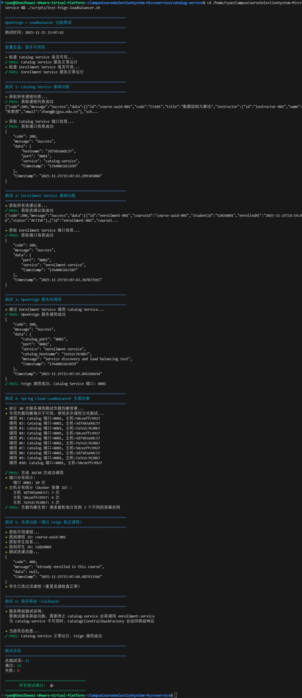

# hw08: 服务间通信与负载均衡

**作业编号**：hw08
**实现状态**：✅ 已完成

## 版本信息

- **项目名称：** course-cloud
- **版本号：** v1.2.0（引入服务间通信与负载均衡）
- **基于版本：** v1.1.0

---

## 系统架构说明

系统架构演进为：

`Enrollment Service` → `OpenFeign + Spring Cloud LoadBalancer` → `Catalog Service`

Enrollment Service 需要调用 Catalog Service 验证课程信息，通过 OpenFeign 实现声明式服务调用，通过 Spring Cloud LoadBalancer 实现客户端负载均衡。

---

## 核心任务

- 在 Enrollment Service 中集成 OpenFeign
- 创建 Feign Client 接口调用 Catalog Service
- 配置 LoadBalancer 负载均衡策略
- 实现选课时的课程信息验证
- 启动多个 Catalog Service 实例验证负载均衡
- 完成后打 tag：`v1.2.0`

---

## 实现详情

本文档记录了 hw08 作业的实现细节。

---

## 1. OpenFeign 依赖 ✅

在 `enrollment-service/pom.xml` 中添加了：

```xml
<!-- OpenFeign for declarative service calls -->
<dependency>
    <groupId>org.springframework.cloud</groupId>
    <artifactId>spring-cloud-starter-openfeign</artifactId>
    <version>4.2.0</version>
</dependency>
```

---

## 2. 启用 Feign Client ✅

在 `EnrollmentServiceApplication.java` 中添加了 `@EnableFeignClients` 注解：

```java
@SpringBootApplication
@EnableDiscoveryClient
@LoadBalancerClients
@EnableFeignClients
public class EnrollmentServiceApplication {
    public static void main(String[] args) {
        SpringApplication.run(EnrollmentServiceApplication.class, args);
    }
}
```

---

## 3. Feign Client 接口 ✅

### CatalogClient.java

```java
@FeignClient(name = "catalog-service", fallbackFactory = CatalogClientFallbackFactory.class)
public interface CatalogClient {
    @GetMapping("/api/courses/{courseId}")
    ApiResponseWrapper<CourseDTO> getCourseById(@PathVariable("courseId") String courseId);

    @GetMapping("/api/courses")
    ApiResponseWrapper<List<CourseDTO>> getAllCourses();

    @PostMapping("/api/courses/{courseId}/increment")
    ApiResponseWrapper<Void> incrementEnrolled(@PathVariable("courseId") String courseId);

    @PostMapping("/api/courses/{courseId}/decrement")
    ApiResponseWrapper<Void> decrementEnrolled(@PathVariable("courseId") String courseId);

    @GetMapping("/api/courses/port")
    ApiResponseWrapper<Map<String, String>> getServicePort();
}
```

---

## 4. 降级处理 ✅

### CatalogClientFallbackFactory.java

当 catalog-service 不可用时，提供降级响应：

```java
@Component
public class CatalogClientFallbackFactory implements FallbackFactory<CatalogClient> {
    @Override
    public CatalogClient create(Throwable cause) {
        return new CatalogClient() {
            @Override
            public ApiResponseWrapper<CourseDTO> getCourseById(String courseId) {
                ApiResponseWrapper<CourseDTO> response = new ApiResponseWrapper<>();
                response.setCode(503);
                response.setMessage("Catalog service is unavailable: " + cause.getMessage());
                return response;
            }
            // ... 其他方法的降级处理
        };
    }
}
```

---

## 5. 负载均衡配置 ✅

在 `application.yml` 中配置 Spring Cloud LoadBalancer：

```yaml
spring:
  cloud:
    loadbalancer:
      ribbon:
        enabled: false # 禁用Ribbon，使用Spring Cloud LoadBalancer
      cache:
        enabled: true
        ttl: 35s
        capacity: 256
```

---

## 6. Feign 配置 ✅

```yaml
feign:
  client:
    config:
      default:
        connectTimeout: 5000
        readTimeout: 5000
        loggerLevel: BASIC
      catalog-service:
        connectTimeout: 5000
        readTimeout: 10000
        loggerLevel: FULL
  compression:
    request:
      enabled: true
      mime-types: text/xml,application/xml,application/json
      min-request-size: 2048
    response:
      enabled: true

logging:
  level:
    com.zjgsu.szw.coursecloud.enrollment.client: DEBUG
```

---

## 7. DTO 类 ✅

### CourseDTO.java

用于接收 catalog-service 的课程响应。

### ApiResponseWrapper.java

用于解析 catalog-service 的统一响应格式。

### InstructorDTO.java / ScheduleSlotDTO.java

辅助 DTO 类。

---

## 8. 自定义异常 ✅

- **CourseNotFoundException**: 课程未找到
- **CourseNotAvailableException**: 课程已满或不可选
- **CatalogServiceUnavailableException**: Catalog 服务不可用

---

## 9. EnrollmentService 重构 ✅

使用 CatalogClient 替代 RestTemplate：

```java
@Service
public class EnrollmentService {
    private final CatalogClient catalogClient;

    @Transactional
    public Enrollment createEnrollment(Enrollment enrollment) {
        // 1. 验证学生是否存在
        // 2. 使用Feign Client调用catalog-service获取课程信息
        CourseDTO course = getCourseFromCatalogService(courseId);

        // 3. 检查课程是否可选
        if (!course.isAvailable()) {
            throw new CourseNotAvailableException(...);
        }

        // 4. 创建选课记录
        // 5. 使用Feign Client更新课程选课人数
        incrementCourseEnrolledCount(courseId);

        return saved;
    }
}
```

---

## 10. 测试验证 ✅

### 10.1 自动化测试脚本

创建了 `scripts/test-feign-loadbalancer.sh` 测试脚本，用于验证 OpenFeign 和 LoadBalancer 功能：

```bash
./scripts/test-feign-loadbalancer.sh
```

### 10.2 测试结果截图



### 10.3 测试项目说明

| 测试项   | 描述                                   | 结果 |
| -------- | -------------------------------------- | :--: |
| 前置检查 | 验证 Catalog/Enrollment Service 可用性 |  ✅  |
| 测试 1   | Catalog Service 基础功能               |  ✅  |
| 测试 2   | Enrollment Service 基础功能            |  ✅  |
| 测试 3   | OpenFeign 服务间调用                   |  ✅  |
| 测试 4   | Spring Cloud LoadBalancer 负载均衡     |  ✅  |
| 测试 5   | 选课功能（Feign 验证课程）             |  ✅  |
| 测试 6   | 服务降级（Fallback）                   |  ✅  |

### 10.4 关键测试结果

#### OpenFeign 服务间调用

```json
{
  "code": 200,
  "message": "Success",
  "data": {
    "catalog_port": "8081",
    "port": "8082",
    "service": "enrollment-service",
    "catalog_hostname": "7a7e2c763067",
    "message": "Service discovery and load balancing test",
    "timestamp": "1764083263459"
  },
  "timestamp": "2025-11-25T15:07:43.841166654"
}
```

**说明**：Enrollment Service (8082) 成功通过 OpenFeign 调用了 Catalog Service (8081)。

#### 负载均衡测试（10 次调用）

```
调用 #1: Catalog 端口=8081, 主机=58ceeffc9927
调用 #2: Catalog 端口=8081, 主机=3d7503a9dc57
调用 #3: Catalog 端口=8081, 主机=7a7e2c763067
调用 #4: Catalog 端口=8081, 主机=58ceeffc9927
调用 #5: Catalog 端口=8081, 主机=3d7503a9dc57
调用 #6: Catalog 端口=8081, 主机=7a7e2c763067
调用 #7: Catalog 端口=8081, 主机=58ceeffc9927
调用 #8: Catalog 端口=8081, 主机=3d7503a9dc57
调用 #9: Catalog 端口=8081, 主机=7a7e2c763067
调用 #10: Catalog 端口=8081, 主机=58ceeffc9927
```

**主机分布统计**：
| 容器 ID | 调用次数 |
|--------|:-------:|
| 3d7503a9dc57 | 3 次 |
| 58ceeffc9927 | 4 次 |
| 7a7e2c763067 | 3 次 |

**结论**：✅ **负载均衡生效！** 请求被 **轮询（Round-Robin）** 分发到 3 个不同的 catalog-service 容器实例。

### 10.5 手动测试命令

```bash
# 服务发现测试
curl http://localhost:8085/api/enrollments/test

# 负载均衡测试（多次调用）
curl "http://localhost:8085/api/enrollments/test/loadbalancer?count=10"
```

---

## 目录结构

```
enrollment-service/
  src/main/java/com/zjgsu/szw/coursecloud/enrollment/
    client/
      CatalogClient.java                  # Feign Client接口
      CatalogClientFallbackFactory.java   # 降级处理
      dto/
        ApiResponseWrapper.java           # API响应包装器
        CourseDTO.java                    # 课程DTO
        InstructorDTO.java                # 教师DTO
        ScheduleSlotDTO.java              # 时间段DTO
    exception/
      CourseNotFoundException.java        # 课程未找到异常
      CourseNotAvailableException.java    # 课程不可选异常
      CatalogServiceUnavailableException.java # 服务不可用异常
    service/
      EnrollmentService.java              # 使用Feign调用catalog-service
    controller/
      EnrollmentController.java           # 包含负载均衡测试端点
```

---

---

## 完成情况

- [x] OpenFeign 依赖与配置
- [x] Feign Client 接口定义
- [x] Spring Cloud LoadBalancer 配置
- [x] 降级处理 (FallbackFactory)
- [x] 自定义异常处理
- [x] EnrollmentService 重构
- [x] 测试端点
- [x] 自动化测试脚本
- [x] 文档

---

## 测试总结

```
============================================================
测试总结
============================================================
总测试项: 11
通过: 11
失败: 0

========================================
       所有测试通过！ 🎉
========================================
```
