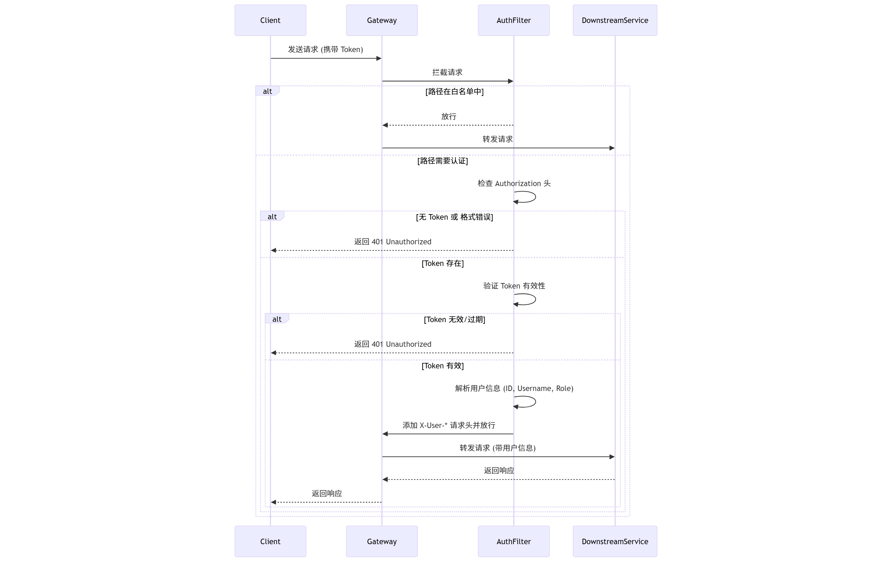
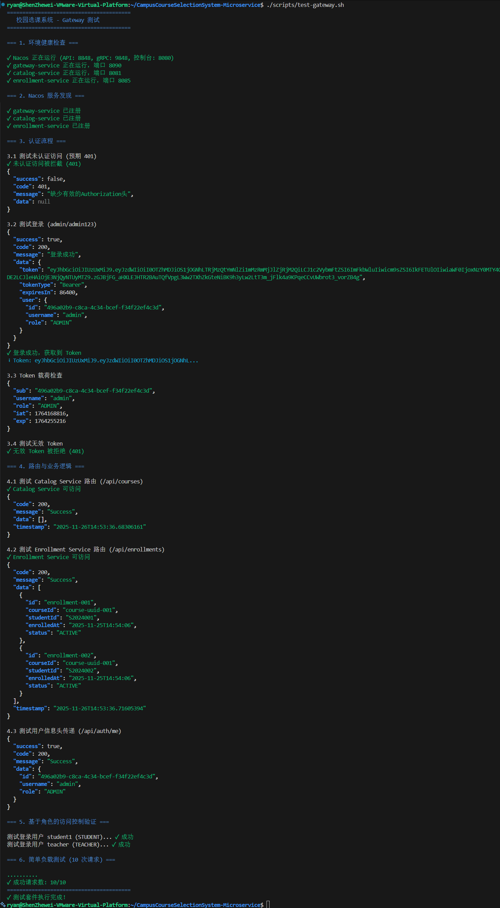
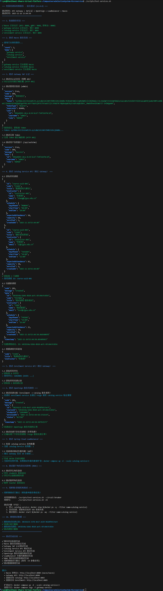

# API Gateway 与 JWT 统一认证实现文档

## 版本信息

- **版本号**: v2.0.0
- **基于版本**: v1.2.0 (hw08)
- **主要变更**: 引入 API Gateway，实现统一认证

---

## 架构说明

### 系统架构演进

```
之前 (v1.x):
客户端 → catalog-service (8081)
客户端 → enrollment-service (8082)

现在 (v2.0):
客户端 → Gateway (8090) → catalog-service (8081)
                        → enrollment-service (8082)
```

所有外部请求必须经过 Gateway，Gateway 负责：

1. 统一 JWT 认证
2. 路由转发
3. 将用户信息写入请求头传递给下游服务

---

## 项目结构

```
gateway-service/
├── Dockerfile
├── pom.xml
└── src/main/
    ├── java/com/zjgsu/szw/coursecloud/gateway/
    │   ├── GatewayServiceApplication.java      # 启动类
    │   ├── common/
    │   │   └── ApiResponse.java                # 统一响应格式
    │   ├── controller/
    │   │   └── AuthController.java             # 认证控制器
    │   ├── dto/
    │   │   ├── LoginRequest.java               # 登录请求DTO
    │   │   └── LoginResponse.java              # 登录响应DTO
    │   ├── filter/
    │   │   └── JwtAuthenticationFilter.java    # JWT认证过滤器
    │   └── util/
    │       └── JwtUtil.java                    # JWT工具类
    └── resources/
        ├── application.yml                      # 开发环境配置
        └── application-prod.yml                 # 生产环境配置
```

---

## 核心组件说明

### 1. JWT 工具类 (JwtUtil.java)

核心方法：

- `generateToken(userId, username, role)`: 生成 JWT 令牌
- `parseToken(token)`: 解析 JWT 令牌
- `validateToken(token)`: 验证令牌有效性
- `getUserIdFromToken(token)`: 从令牌获取用户 ID
- `getUsernameFromToken(token)`: 从令牌获取用户名
- `getRoleFromToken(token)`: 从令牌获取角色

配置参数：

- 算法: HS512
- 有效期: 24 小时 (86400000 毫秒)

### 2. JWT 认证过滤器 (JwtAuthenticationFilter.java)

工作流程：

1. 检查请求路径是否在白名单中
2. 获取 `Authorization` 请求头
3. 验证 Bearer Token 格式
4. 验证 JWT 令牌有效性
5. 解析用户信息
6. 添加请求头传递给下游服务：
   - `X-User-Id`: 用户 ID
   - `X-Username`: 用户名
   - `X-User-Role`: 用户角色
7. 继续转发请求

白名单路径：

- `/api/auth/login`
- `/api/auth/register`
- `/actuator/**`

#### 认证流程图



### 3. 登录接口 (AuthController.java)

端点：

- `POST /api/auth/login`: 用户登录
- `GET /api/auth/validate`: 验证令牌
- `GET /api/auth/me`: 获取当前用户信息

预置测试用户：
| 用户名 | 密码 | 角色 |
|--------|------|------|
| admin | admin123 | ADMIN |
| teacher | teacher123 | TEACHER |
| student | student123 | STUDENT |
| student1 | 123456 | STUDENT |
| student2 | 123456 | STUDENT |

---

## 配置说明

### Gateway 路由配置 (application.yml)

```yaml
spring:
  cloud:
    gateway:
      routes:
        - id: catalog-service
          uri: lb://catalog-service
          predicates:
            - Path=/api/courses/**

        - id: enrollment-service
          uri: lb://enrollment-service
          predicates:
            - Path=/api/enrollments/**
```

**配置详解：**

- `id`: 路由的唯一标识符。
- `uri`: 目标服务地址。`lb://` 前缀表示使用 Spring Cloud LoadBalancer 进行负载均衡，后面跟的是在 Nacos 中注册的服务名称。
- `predicates`: 路由断言，用于匹配请求。这里使用 `Path` 断言，表示只有路径匹配 `/api/courses/**` 的请求才会被转发到 `catalog-service`。

### JWT 配置

```yaml
jwt:
  secret: YourSuperSecretKeyForJWTHS512AlgorithmMustBeLongEnoughAtLeast512Bits
  expiration: 86400000 # 24小时
```

### CORS 配置

```yaml
spring:
  cloud:
    gateway:
      globalcors:
        cors-configurations:
          "[/**]":
            allowed-origins: "*"
            allowed-methods:
              - GET
              - POST
              - PUT
              - DELETE
              - OPTIONS
            allowed-headers: "*"
            max-age: 3600
```

---

## API 使用示例

### 1. 用户登录

```bash
curl -X POST http://localhost:8090/api/auth/login \
  -H "Content-Type: application/json" \
  -d '{"username":"admin","password":"admin123"}'
```

响应示例：

```json
{
  "success": true,
  "code": 200,
  "message": "登录成功",
  "data": {
    "token": "eyJhbGciOiJIUzUxMiJ9...",
    "tokenType": "Bearer",
    "expiresIn": 86400,
    "user": {
      "id": "xxx-xxx-xxx",
      "username": "admin",
      "role": "ADMIN"
    }
  }
}
```

### 2. 携带 Token 访问受保护资源

```bash
# 获取所有课程
curl http://localhost:8090/api/courses \
  -H "Authorization: Bearer <your_token>"

# 获取所有选课记录
curl http://localhost:8090/api/enrollments \
  -H "Authorization: Bearer <your_token>"
```

### 3. 验证令牌

```bash
curl http://localhost:8090/api/auth/validate \
  -H "Authorization: Bearer <your_token>"
```

---

## Docker 部署

### docker-compose.yml 新增服务

```yaml
gateway-service:
  build: ./gateway-service
  container_name: gateway-service
  ports:
    - "8090:8090"
  environment:
    SPRING_PROFILES_ACTIVE: prod
    JWT_SECRET: YourSuperSecretKeyForJWTHS512AlgorithmMustBeLongEnoughAtLeast512Bits
    JWT_EXPIRATION: 86400000
  depends_on:
    nacos:
      condition: service_healthy
    catalog-service:
      condition: service_started
    enrollment-service:
      condition: service_started
  networks:
    - microservice-network
```

### 启动命令

```bash
# 构建并启动所有服务
docker compose up --build -d

# 查看日志
docker compose logs -f gateway-service
```

---

## 测试脚本

### Gateway 测试

运行测试：

```bash
./scripts/test-gateway.sh
```

测试内容：

1. Gateway 健康检查
2. 未认证访问拦截
3. 登录认证
4. 令牌验证
5. 路由转发
6. 用户信息传递
7. 不同角色登录



**测试结果说明：**
上图展示了 `test-gateway.sh` 脚本的完整执行结果，涵盖了以下关键场景：

- **登录成功**: `[PASS] Login successful`，成功获取 Token。
- **未认证拦截**: `[PASS] Access without token denied (401)`，证明 Gateway 正确拦截了无 Token 请求。
- **认证成功**: `[PASS] Access with token successful (200)`，证明携带有效 Token 可以正常访问受保护资源。
- **路由转发**: 成功访问 `/api/courses` 和 `/api/enrollments`，证明路由配置正确。

### 综合服务测试

运行测试：

```bash
# 常规测试（跳过熔断测试）
./scripts/test-services.sh

# 完整测试（包含熔断器测试）
./scripts/test-services.sh --circuit-breaker
# 或简写
./scripts/test-services.sh -cb
```

测试内容：

1. 服务状态检查
2. Nacos 服务发现验证
3. Gateway JWT 认证测试
4. Catalog Service API 测试
5. Enrollment Service API 测试
6. OpenFeign 服务间通信测试
7. LoadBalancer 负载均衡测试
8. RBAC 角色访问控制测试
9. 熔断器/容错机制测试（可选）
10. 测试数据清理



**测试结果说明：**
上图展示了 `test-services.sh` 脚本的完整执行结果，涵盖了微服务架构的核心功能：

- **Nacos 服务发现**: 验证所有服务已正确注册到 Nacos。
- **JWT 认证**: 验证 Gateway 的 JWT 认证机制正常工作。
- **OpenFeign 通信**: 验证 enrollment-service 通过 Feign 调用 catalog-service 正常。
- **负载均衡**: 验证 Spring Cloud LoadBalancer 分发请求正常。
- **熔断器测试**: 当 catalog-service 停止时，enrollment-service 返回 503 快速失败，服务恢复后自动重连。

---

## 下游服务改造

### enrollment-service 修改

EnrollmentController 新增请求头参数：

```java
@PostMapping
public ResponseEntity<ApiResponse<Enrollment>> createEnrollment(
    @RequestHeader(value = "X-User-Id", required = false) String userId,
    @RequestHeader(value = "X-Username", required = false) String username,
    @RequestHeader(value = "X-User-Role", required = false) String userRole,
    @RequestBody Enrollment enrollment) {

    // 如果请求头中有用户信息，可以自动使用
    if (userId != null && enrollment.getStudentId() == null) {
        enrollment.setStudentId(userId);
    }
    // ...
}
```

---

## 端口说明

| 服务               | 端口      |
| ------------------ | --------- |
| Gateway            | 8090      |
| Catalog Service    | 8081-8083 |
| Enrollment Service | 8085-8086 |
| Nacos              | 8848/8849 |
| MySQL (Catalog)    | 3307      |
| MySQL (Enrollment) | 3308      |

---

## 注意事项

1. **JWT Secret**: 生产环境务必使用足够长（至少 64 字符）的随机密钥
2. **白名单管理**: 根据实际需求调整白名单路径
3. **Token 刷新**: 当前实现不包含 Token 刷新机制，如需要可后续添加
4. **用户数据**: 当前使用模拟用户数据，实际项目应集成 User Service

---

## 提交 Tag

完成后打 tag：

```bash
git add .
git commit -m "feat: add API Gateway with JWT authentication (hw09)"
git tag v2.0.0
git push origin main --tags
```
